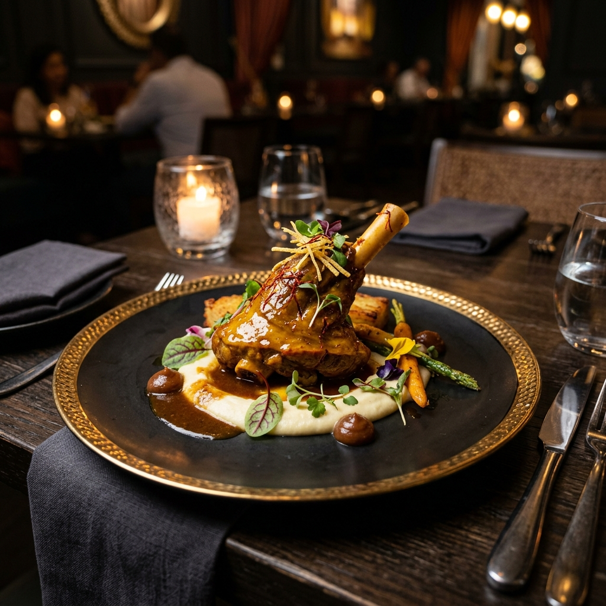
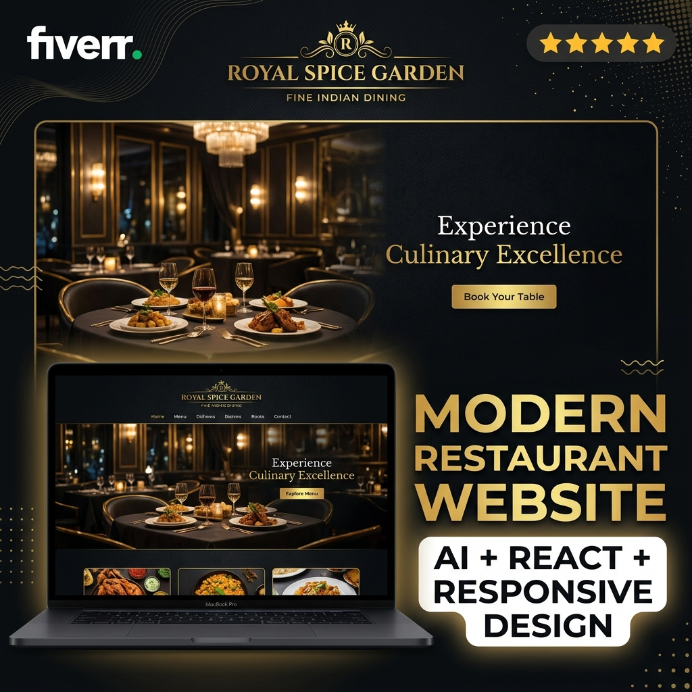
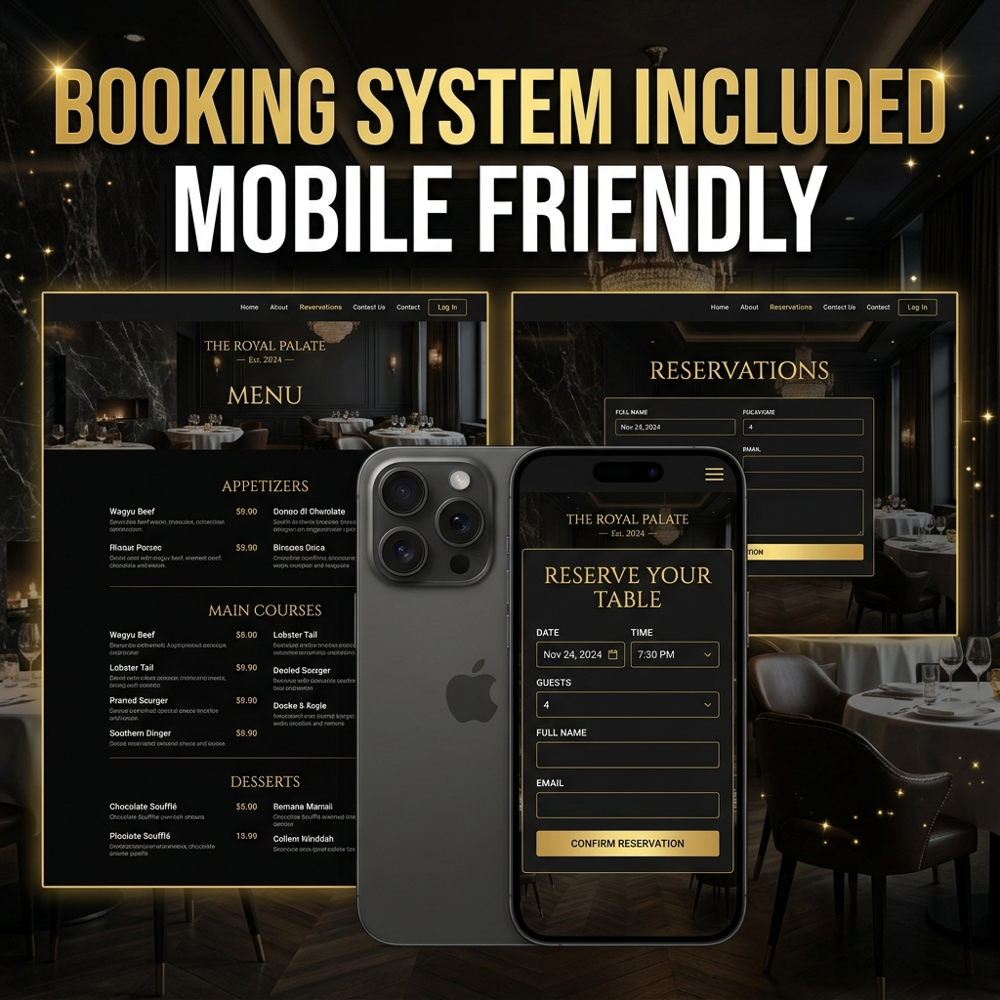

# <p align="center"><br>Royal Spice Garden</p>

<p align="center">
  <strong>Where Culinary Art Meets Timeless Luxury</strong>
</p>

<p align="center">
  
  
  
</p>

---

## 🍽️ Project Overview

**Royal Spice Garden** is a premium, client-ready fine-dining web application built for the luxury hospitality sector. Seamlessly fusing deep-rooted culinary heritage with modern interactive interfaces, this platform is engineered to deliver a digital experience that mirrors the sophistication of a Michelin-starred establishment.

Built with **React**, **TypeScript**, and **Tailwind CSS**, it features a fully optimized booking flow, dynamic menu curation, interactive gallery modules, and responsive animations designed to convert digital visitors into reserved patrons.

---

## ✨ Features Showcase

### 📅 Smart Reservation System
An intuitive, client-side validated booking interface designed to maximize dining seat conversions.
*   **Dynamic Time-Slot Allocator:** Locks out past dates and validates seating availability in real-time.
*   **Seating Customizer:** Allows patrons to choose between the main dining room, outdoor spice lounge, or the private vault.
*   **Animated Success State:** Instantly compiles details and delivers a premium confirmation card.

### 🍽️ Interactive Menu Experience
A smooth, tab-based menu directory that displays dishes, ingredients, and sommelier pairings with zero latency.
*   **Course Filtering:** Appetizers, Mains, Desserts, and Royal Cocktails.
*   **Dietary Badges:** Clear iconography for Veg, Gluten-Free, Spicy, and Chef Specialities.
*   **Wine Pairings:** Pre-matched sommelier recommendations for signature dishes.

### 🖼️ Ambiance Gallery Showcase
A masonry-style visual grid highlighting the physical restaurant environment and culinary art.
*   **Interactive Modal Lightbox:** Allows seamless panning, keyboard navigation (Left/Right/ESC), and close-up views of high-resolution gastronomy shots.
*   **Cinematic Hover Transitions:** Micro-zoom effects overlaying descriptive plates metadata.

### 💬 Verified Customer Reviews
An autoplaying, swipe-supported client feedback slider showing detailed star ratings and critics testimonies to establish social proof.

### 📱 Responsive & Mobile-First Optimization
Every view is built with fluid grid structures, ensuring a flawless layout on 4K desktop screens, tablets, and smartphones alike.

---

## 💻 Visual Screenshots

### 🖥️ Desktop Showcase
<p align="center">
  
</p>

### 📱 Mobile UI & Reservation Flow
<p align="center">
  
  
</p>

---

## 🔗 Live Demo

Experience the luxury interface live:
👉 **[Royal Spice Garden Live Demo](#)** *(Insert your Vercel deployment link here)*

---

## 🛠️ Technology Stack

| Layer | Technology | Purpose |
| :--- | :--- | :--- |
| **Frontend Framework** | **React 18** | Modular component architecture |
| **Type Safety** | **TypeScript** | Strict compile-time checks for bulletproof data validation |
| **Styling** | **Tailwind CSS** | Premium utility-first CSS configurations |
| **Icons** | **Lucide Icons** | Clean, minimalist SVG iconography |
| **Deployment** | **Vercel** | High-performance CDN hosting and automated CI/CD pipelines |

---

## 🚀 Installation & Local setup

Follow these steps to run the development server locally:

### Prerequisites
*   Node.js (v18.0.0 or higher)
*   npm or yarn

### 1. Clone the Repository
```bash
git clone https://github.com/GsrBhat/royal-spice-garden-website.git
cd royal-spice-garden-website
```

### 2. Install Dependencies
```bash
npm install
```

### 3. Run Development Server
```bash
npm run dev
```
Open [http://localhost:5173](http://localhost:5173) in your browser to view the application.

### 4. Build for Production
```bash
npm run build
```
The optimized production bundle will be generated inside the `dist/` directory.

---

## 📄 License
Distributed under the MIT License. See `LICENSE` for more information.

---

<p align="center">
  <sub>Portfolio Demonstration Project. Designed & Developed by <strong>Sai Rahul</strong>.</sub>
</p>
